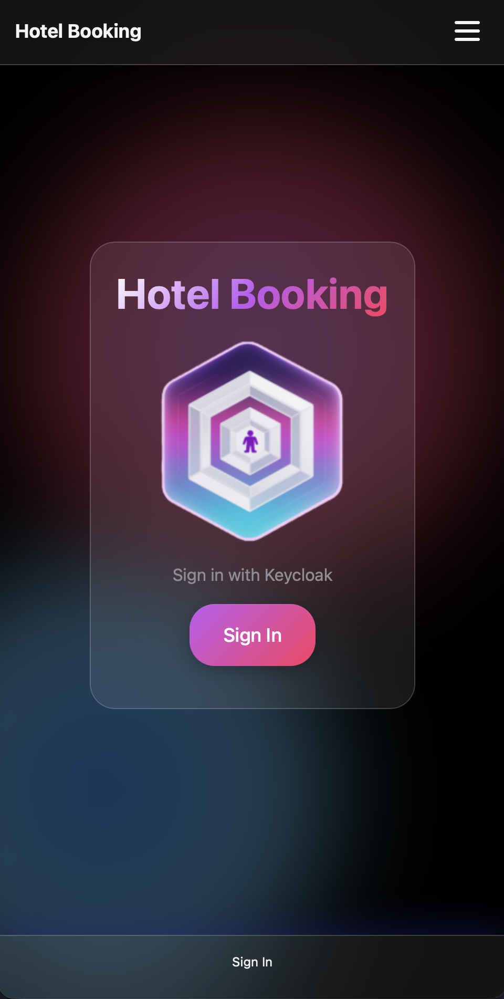

<p align="center">
  
</p>

# Go DDD Hexagonal Starter

[](https://pkg.go.dev/github.com/andygeiss/go-ddd-hex-starter)
[](https://goreportcard.com/report/github.com/andygeiss/go-ddd-hex-starter)
[](https://github.com/andygeiss/go-ddd-hex-starter/releases)

A production-ready Go template demonstrating Domain-Driven Design (DDD) and Hexagonal Architecture (Ports and Adapters).

## Overview / Motivation

This repository serves as a **reusable blueprint** for building maintainable Go applications with well-defined boundaries. It implements the **Ports and Adapters** (Hexagonal) pattern to decouple domain logic from external concerns like HTTP, databases, or messaging.

The goal is to provide a consistent, well-documented structure that can be used by developers and AI coding agents alike to bootstrap new projects without reinventing the wheel.

## Key Features

- **Hexagonal Architecture**: Strict separation of concerns with a pure domain layer.
- **Domain-Driven Design**: Focus on core business logic and entities.
- **Production-Ready Stack**:
  - **HTTP Server**: Standard `net/http` with OIDC authentication.
  - **CLI Tool**: Example command-line interface sharing the same domain logic.
  - **Structured Logging**: JSON logs using `log/slog`.
  - **Observability**: Profile-Guided Optimization (PGO) support.
- **Developer Experience**:
  - **Justfile**: Simplified command runner for build, test, and run workflows.
  - **Docker/Podman**: Containerized development and build environment.
  - **Vendor Utilities**: Leverages `cloud-native-utils` for common patterns.

## Architecture Overview

The project follows a strict **Hexagonal Architecture** with three distinct layers:

1.  **Domain (`internal/domain`)**: The core business logic. It contains entities, value objects, and port definitions (interfaces). It has **no dependencies** on outer layers.
2.  **Adapters (`internal/adapters`)**: Implementations of the ports defined in the domain.
    -   **Inbound**: Drive the application (e.g., HTTP handlers, CLI commands).
    -   **Outbound**: Driven by the application (e.g., repositories, event publishers).
3.  **Application (`cmd/`)**: The entry points that wire everything together using dependency injection.

## Project Structure

```text
.
├── .justfile               # Command runner configuration
├── CONTEXT.md              # Architectural constraints and agent rules
├── VENDOR.md               # Documentation for external utilities
├── cmd/                    # Application entry points
│   ├── cli/                # CLI application
│   └── server/             # HTTP server application
├── internal/               # Private application code
│   ├── adapters/           # Infrastructure implementations
│   │   ├── inbound/        # Driving adapters (HTTP, etc.)
│   │   └── outbound/       # Driven adapters (Repositories, etc.)
│   └── domain/             # Core business logic (Ports, Entities)
└── tools/                  # Build and maintenance scripts
```

## Conventions & Standards

> The coding style in this repository reflects a combination of widely used practices, prior experience, and personal preference, and is influenced by the Go projects on github.com/andygeiss. There is no single “best” project setup; you are encouraged to adapt this structure, evolve your own style, and use this repository as a starting point for your own projects.

- **Dependency Injection**: Explicitly passed in `main.go`. No global state.
- **Context**: All operations accept `context.Context` as the first parameter.
- **Testing**: Follows Arrange–Act–Assert.

## Using this Repository as a Template

1.  **Clone or Fork**: Start by copying this repository.
2.  **Rename Module**: Update `go.mod` with your module path.
3.  **Define Domain**: Replace `internal/domain` content with your business logic.
4.  **Implement Adapters**: Add necessary adapters in `internal/adapters`.
5.  **Wire Up**: Update `cmd/` to inject your new adapters.

## Getting Started

### Prerequisites

- **Go 1.25+**
- **Just** (Command runner)
- **Docker** or **Podman** (for containerized builds)

### Setup

Install dependencies (macOS/Linux):

```bash
just setup
```

## Running, Scripts, and Workflows

The project uses `just` to manage common tasks.

- **Build Container**:
  ```bash
  just build
  ```
- **Start Services (Docker Compose)**:
  ```bash
  just up
  ```
  This will generate a local secret, build the image, and start the stack (including Keycloak).
- **Stop Services**:
  ```bash
  just down
  ```
- **Run CLI Locally**:
  ```bash
  just run
  ```
- **Run Server Locally**:
  ```bash
  just serve
  ```
- **Generate PGO Profile**:
  ```bash
  just profile
  ```

## Usage Examples

### CLI

The CLI tool indexes files in a directory:

```bash
go run cmd/cli/main.go
```

### HTTP Server

The server provides a web interface with OIDC login:

```bash
go run cmd/server/main.go
```
Access it at `http://localhost:8080` (default).

## Testing & Quality

Run unit tests with coverage:

```bash
just test
```

This runs tests in `internal/...` and outputs the coverage percentage.

## CI/CD

*Currently, no CI/CD workflows are configured in `.github/workflows`.*

## Limitations and Roadmap

- **Database**: Currently uses a file-based JSON repository (`cloud-native-utils/resource`). For production, replace with a SQL/NoSQL adapter.
- **Authentication**: Configured for Keycloak/OIDC. Requires a running Identity Provider.
